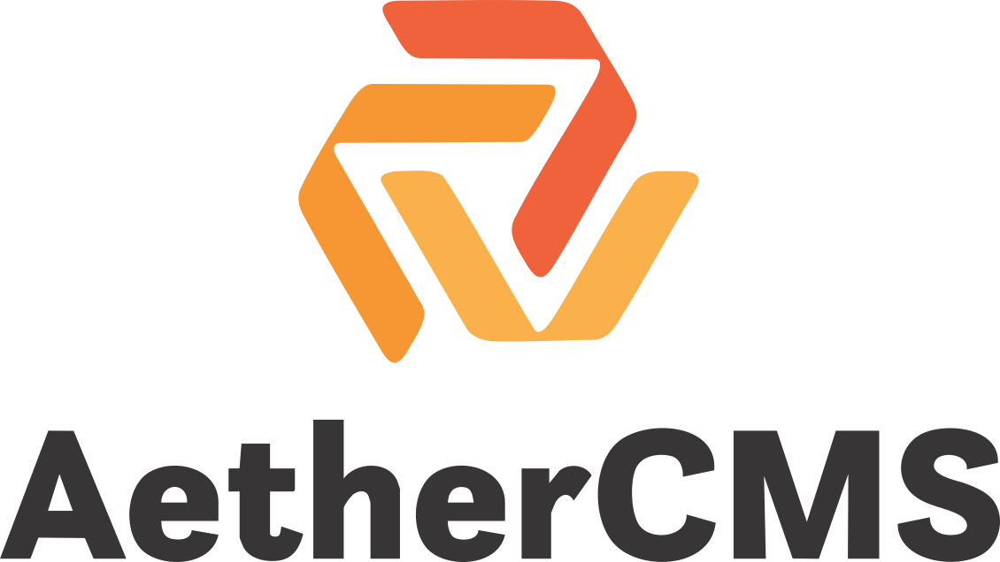

{width="2.697055993000875in"
height="1.5170483377077866in"}

AI-First Headless CMS

Dokumentacja

Techniczno-Biznesowa

Wersja 1.0

Autor: Łukasz Dróżdż

1.  1.  

    ```{=html}
    <!-- -->
    ```
    2.  

**Część I -- Techniczna [3](#_Toc)**Wstęp i cele projektu
[3](#_Toc1)Architektura systemu [4](#_Toc2)Frontend [4](#_Toc3)

Backend [4](#_Toc4)

AI/ML [5](#_Toc5)

Infrastruktura [5](#_Toc6)

3.  

```{=html}
<!-- -->
```
4.  

```{=html}
<!-- -->
```
5.  

```{=html}
<!-- -->
```
2.  1.  

    ```{=html}
    <!-- -->
    ```
    2.  

    ```{=html}
    <!-- -->
    ```
    3.  

    ```{=html}
    <!-- -->
    ```
    4.  

    ```{=html}
    <!-- -->
    ```
    5.  

```{=html}
<!-- -->
```
3.  1.  

    ```{=html}
    <!-- -->
    ```
    2.  

Stack technologiczny [6](#_Toc7)Funkcjonalności systemu
[6](#_Toc8)Bezpieczeństwo [6](#_Toc9)**Część II -- Biznesowa
[7](#_Toc10)**Roadmapa i kamienie milowe [7](#_Toc11)Model biznesowy
[7](#_Toc12)Analiza rynku i konkurencji [7](#_Toc13)Finanse
[8](#_Toc14)Strategia rozwoju [8](#_Toc15)**Część III -- Podsumowanie
[9](#_Toc16)**Kluczowe przewagi konkurencyjne [9](#_Toc17)Kolejne kroki
[9](#_Toc18)

[]{#_Toc .anchor}Część I -- Techniczna

[]{#_Toc1 .anchor} Wstęp i cele projektu

Projekt AI-First Headless CMS ma na celu stworzenie nowoczesnego,
elastycznego i skalowalnego systemu zarządzania treścią, który znacząco
wyróżnia się na tle klasycznych rozwiązań, takich jak WordPress czy
Strapi. System od początku jest projektowany z myślą o integracji
sztucznej inteligencji (AI), co umożliwia automatyczne generowanie
treści, analizę SEO, rekomendacje dla użytkowników oraz inteligentne
tagowanie mediów.

Celem projektu jest stworzenie **nowoczesnego systemu zarządzania
treścią (CMS)** w architekturze **headless**, którego główną różnicą w
stosunku do konkurencji (WordPress, Strapi, Ghost) będzie **AI-first
design**.

Celem jest również stworzenie rozwiązania w pełni modularnego, które
można wdrożyć zarówno w modelu self-hosted, jak i w modelu SaaS, przy
jednoczesnym zachowaniu niezależności od zewnętrznych, płatnych usług
API. System ma wspierać tworzenie i publikację treści w sposób
intuicyjny, przyjazny dla użytkowników nieposiadających wiedzy
technicznej, a jednocześnie dawać deweloperom pełną kontrolę nad
rozbudową i integracjami.

**Od początku wbudowane zostaną mechanizmy sztucznej inteligencji
wspierające:**

generowanie treści,

optymalizację SEO,

automatyczne tagowanie i analizę multimediów,

rekomendacje treści dla użytkowników końcowych.

**System ma być:**

skalowalny (mikroserwisy, Kubernetes),

rozszerzalny (pluginy, hooki),

niezależny od drogich API SaaS,

możliwy do wdrożenia jako self-hosted lub SaaS.

[]{#_Toc2 .anchor} Architektura systemu

Architektura systemu została zaprojektowana w taki sposób, aby zapewnić
wysoką skalowalność, niezawodność oraz łatwość w rozszerzaniu
funkcjonalności.\
\
System podzielono na cztery główne warstwy:

[]{#_Toc3 .anchor}Frontend

Frontend systemu oparty jest na frameworku Next.js i bibliotece React.
Panel administracyjny umożliwia zarządzanie treścią, a strona publiczna
-- wyświetlanie treści użytkownikom końcowym. Komunikacja między
frontendem a backendem realizowana jest za pomocą Apollo Client i
protokołu GraphQL, co pozwala na efektywne pobieranie i aktualizowanie
danych oraz pełną kontrolę nad strukturą zapytań.

W warstwie frontendowej kluczowym elementem jest TipTap, który pełni
rolę głównego edytora treści. TipTap to elastyczny edytor blokowy dla
Reacta, który umożliwia tworzenie wizualnych treści w sposób WYSIWYG,
bez konieczności pisania kodu przez redaktorów. Edytor jest modularny,
co pozwala na łatwe dodawanie własnych bloków, takich jak:

AI-assisted content -- automatyczne podpowiedzi tekstowe, generowanie
akapitów lub rekomendacje SEO,

Media blocks -- wstawianie obrazów, wideo, audio oraz embedów
zewnętrznych,

Custom components -- np. interaktywne formularze, ankiety lub dynamiczne
treści.

TipTap jako open-source na licencji MIT zapewnia brak kosztów
licencyjnych w wersji podstawowej, a w przyszłości można wprowadzić
funkcje Pro (real-time collaboration, historia zmian) jako opcjonalne
rozszerzenia premium.

[]{#_Toc4 .anchor}Backend

Backend systemu został zbudowany w oparciu o Python i framework FastAPI,
co zapewnia wysoką wydajność i prostotę integracji z modułami AI.
Warstwa backendowa korzysta z bazy danych PostgreSQL, zarządzanej
poprzez SQLAlchemy oraz Alembic (do migracji schematów).

Dzięki zastosowaniu Strawberry GraphQL backend udostępnia zunifikowany
interfejs API, który pozwala na dostęp do wszystkich zasobów systemu
(treści, użytkownicy, media) w sposób spójny i elastyczny. System
wspiera również mechanizm pluginów oraz hooków oparty na bibliotece
pluggy, co umożliwia deweloperom tworzenie własnych rozszerzeń bez
konieczności modyfikacji core CMS.

[]{#_Toc5 .anchor}AI/ML

System posiada wbudowane moduły sztucznej inteligencji, które wspierają
generowanie treści, analizę multimediów oraz rekomendacje.

**W tym celu wykorzystano:**

HuggingFace Transformers -- generowanie i analiza tekstów, podpowiedzi
dla redaktorów, optymalizacja SEO,

Whisper -- automatyczna transkrypcja plików audio,

CLIP -- analiza i tagowanie obrazów,

FAISS -- wyszukiwanie wektorowe, rekomendacje treści.

**Dzięki temu system jest w stanie samodzielnie sugerować poprawki,
rekomendować treści podobne lub przygotowywać podsumowania artykułów.**

[]{#_Toc6 .anchor}Infrastruktura

**Do wdrożenia i utrzymania systemu użyto nowoczesnych narzędzi:**

Docker i Kubernetes -- konteneryzacja i orkiestracja, zapewniająca
skalowalność,

CI/CD -- GitHub Actions -- automatyzacja procesów build/test/deploy,

Redis -- cache i kolejki zadań,

Prometheus + Grafana -- monitoring i alerty,

Storage S3-compatible -- np. MinIO, do przechowywania mediów i backupów.

[]{#_Toc7 .anchor} Stack technologiczny

W skrócie, stack technologiczny wygląda następująco:

  ---------------- --------------------------------------------------------
  **Warstwa**      **Technologie**

  Frontend         Next.js, React, Apollo Client, TipTap/Editor.js

  Backend          Python FastAPI, Strawberry GraphQL, PostgreSQL,
                   SQLAlchemy, Alembic

  AI/ML            HuggingFace Transformers, Whisper, CLIP, FAISS

  Infrastruktura   Docker, Kubernetes, GitHub Actions, Redis, Prometheus,
                   Grafana, MinIO (S3)
  ---------------- --------------------------------------------------------

[]{#_Toc8 .anchor} Funkcjonalności systemu

**System oferuje szeroki wachlarz funkcji:**

Core CMS: zarządzanie treścią, publikacja artykułów, obsługa mediów,
system użytkowników i workflow publikacji.

TipTap jako edytor główny: intuicyjny, wizualny, pozwala tworzyć treści
WYSIWYG, obsługuje AI-asystę, media oraz custom components.

Plugin system: elastyczne hooki pozwalają rozszerzać system o nowe
funkcjonalności i integracje.

API GraphQL: zapewnia zunifikowany dostęp do wszystkich danych systemu,
dla frontendu oraz zewnętrznych aplikacji.

[]{#_Toc9 .anchor} Bezpieczeństwo

**System kładzie duży nacisk na bezpieczeństwo danych i użytkowników:**

RBAC -- zarządzanie rolami i uprawnieniami użytkowników,

JWT + 2FA -- autoryzacja i weryfikacja tożsamości,

Szyfrowanie TLS/AES -- ochrona komunikacji i danych wrażliwych,

Audit logi -- rejestrowanie działań użytkowników i systemu,

Monitoring i alerty -- szybkie powiadamianie o potencjalnych
zagrożeniach.

1.  []{#_Toc10 .anchor}Część II -- Biznesowa

    1.  []{#_Toc11 .anchor} Roadmapa i kamienie milowe

  --------------- ----------------------------------------------- -------------
  **Milestone**   **Opis**                                        **Szacowany
                                                                  czas**

  M1              Core CMS + backend API + integracja TipTap      3 miesiące

  M2              Frontend panel admina + konfiguracja bloków     2 miesiące
                  TipTap                                          

  M3              Moduły AI/ML + integracja TipTap (podpowiedzi,  3 miesiące
                  rekomendacje)                                   

  M4              System pluginów + stabilizacja SaaS +           4 miesiące
                  rozszerzenia TipTap Pro                         
  --------------- ----------------------------------------------- -------------

2.  []{#_Toc12 .anchor} Model biznesowy

**System wykorzystuje hybrydowy model open-source + SaaS:**

Open-source core: darmowy, budujący społeczność deweloperów.

SaaS hosting: płatne subskrypcje miesięczne lub roczne.

Marketplace pluginów: sprzedaż wtyczek i rozszerzeń premium.

Enterprise: płatne wdrożenia, integracje, SLA i support.

3.  []{#_Toc13 .anchor} Analiza rynku i konkurencji

**Na rynku istnieją rozwiązania takie jak WordPress, Strapi czy Ghost.
Nasze przewagi:**

nativne AI wbudowane od początku,

modularna architektura pluginów,

nowoczesny, skalowalny stack technologiczny,

możliwość rozwoju bez kosztów licencyjnych w podstawowej wersji.

4.  []{#_Toc14 .anchor} Finanse

**Szacowane koszty pierwszego roku**

Zespół developerski (5 osób) -- ?

Infrastruktura -- ?

Marketing i community -- ?\
**Łącznie: ?**

**Potencjalne przychody (rok 2--3)**

SaaS subskrypcje: 500 000 -- 2 000 000 PLN

Marketplace pluginów: 200 000 -- 1 000 000 PLN

Kontrakty Enterprise: 300 000 -- 1 500 000 PLN

5.  []{#_Toc15 .anchor} Strategia rozwoju

```{=html}
<!-- -->
```
1.  Wydanie MVP i budowanie społeczności open-source.

2.  Rozwój marketplace wtyczek i hooków.

3.  Wdrożenie SaaS i skalowanie liczby klientów.

4.  Partnerstwa z firmami technologicznymi.

```{=html}
<!-- -->
```
2.  []{#_Toc16 .anchor}Część III -- Podsumowanie

    1.  []{#_Toc17 .anchor} Kluczowe przewagi konkurencyjne

        AI-first od samego początku projektu,

        Nowoczesny stack technologiczny (Python, React, GraphQL),

        Elastyczny system pluginów i hooków,

        TipTap jako edytor wizualny WYSIWYG z możliwością rozszerzeń AI
        i multimediów,

        Transparentny model open-source + SaaS.

    2.  []{#_Toc18 .anchor} Kolejne kroki

        Finalizacja architektury i rozpoczęcie developmentu (M1).

        Budowa społeczności deweloperów (GitHub, Discord).

        Przygotowanie wersji demo dla inwestorów.

        Start działań marketingowych i networkingowych.
